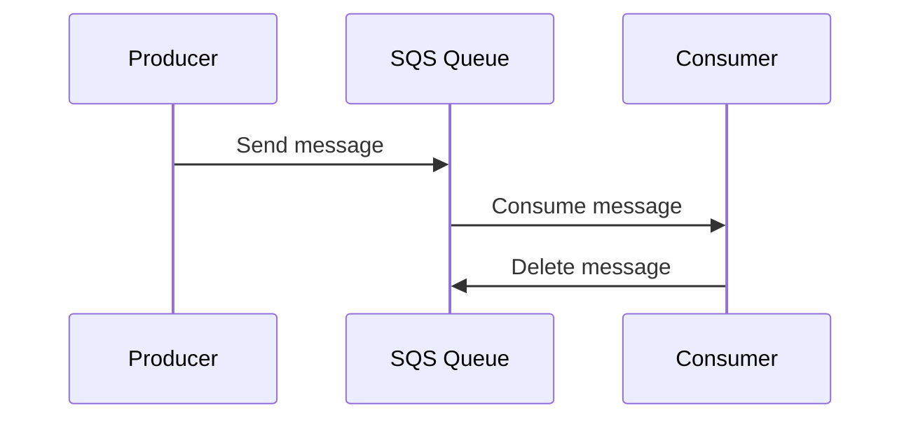
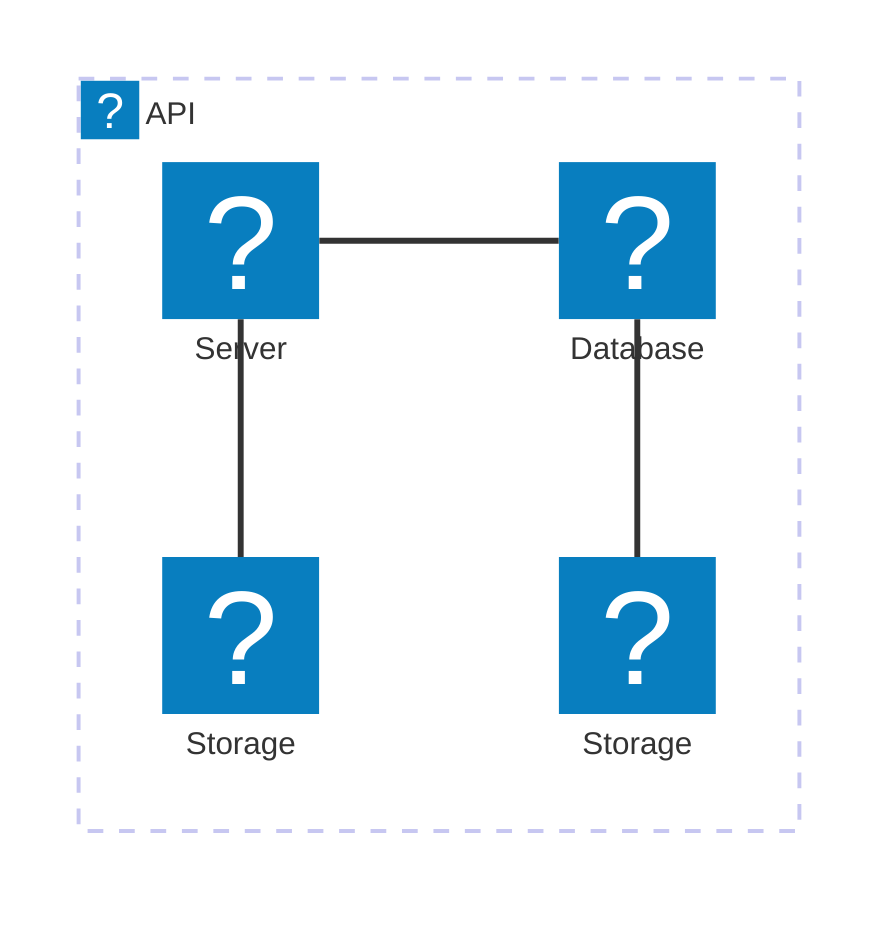

# demo-sqs
SQS Demo using node.js for Solutions Monthly BrownBag Session

```mermaid
sequenceDiagram
  participant Producer
  participant SQS Queue
  participant Consumer

  Producer ->> SQS Queue: Send message
  SQS Queue ->> Consumer: Consume message
  Consumer ->> SQS Queue: Delete message
```

```mermaid
architecture-beta
    group api(logos:aws-lambda)[API]

    service db(logos:aws-aurora)[Database] in api
    service disk1(logos:aws-glacier)[Storage] in api
    service disk2(logos:aws-s3)[Storage] in api
    service server(logos:aws-ec2)[Server] in api

    db:L -- R:server
    disk1:T -- B:server
    disk2:T -- B:db

```
