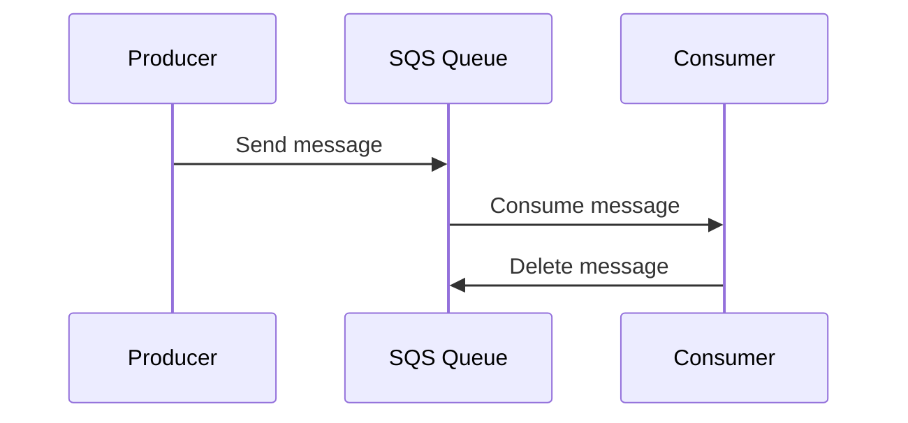

# demo-sqs

SQS produce/consume demo for the Solutions Monthly BrownBag Session, written in TypeScript and running entirely against a local [ElasticMQ](https://github.com/softwaremill/elasticmq) container - no AWS account needed.



## Prerequisites

- Node.js 22+ (see `.nvmrc`)
- Docker, with the `docker compose` plugin

## Quickstart

```sh
npm install
npm run dev
```

`npm run dev` starts the local queue, waits for it to be healthy, creates `DemoQueue` if needed, and starts a worker that long-polls it. In another terminal, produce some orders:

```sh
npm run demo        # sends 5 fake orders
```

Watch the worker's terminal log each order as it's processed, or browse the queue directly at the ElasticMQ web UI: **http://localhost:9325**.

## Scripts

| Script                 | What it does                                                    |
| ---------------------- | --------------------------------------------------------------- |
| `npm run sqs:up`       | Start the local ElasticMQ container                             |
| `npm run sqs:down`     | Stop and remove it                                              |
| `npm run sqs:logs`     | Tail its logs                                                   |
| `npm run queue:create` | Create `DemoQueue` if it doesn't exist yet                      |
| `npm run produce`      | Send one fake order (`npm run produce -- 5` sends five)         |
| `npm run consume`      | Receive and process one batch of orders, then exit              |
| `npm run worker`       | Long-poll continuously until Ctrl-C                             |
| `npm run dev`          | `sqs:up` + `queue:create` + `worker`                            |
| `npm run demo`         | Send a burst of 5 orders                                        |
| `npm run lint`         | Lint with [oxlint](https://oxc.rs/docs/guide/usage/linter.html) |
| `npm run format`       | Format with [oxfmt](https://oxc.rs)                             |
| `npm run typecheck`    | Type-check with `tsc`                                           |
| `npm run test`         | Unit tests (mocked SQS client, no Docker needed)                |
| `npm run test:e2e`     | End-to-end tests against a real ElasticMQ container             |
| `npm run check`        | format:check + lint + typecheck + test - what CI runs           |

## Project layout

```
src/
  config/env/     - env.ts (the only place environment variables are read), env.types.ts, env.test.ts
  lib/logger/     - logger.ts (minimal structured logger), logger.types.ts
  domain/order/   - order.ts (the "order" message shape: create, serialize, parse), order.types.ts, order.test.ts
  utils/          - fake-data generator, SQS message-attribute helper
  sqs/
    client.ts     - builds the SQSClient from config
    queue/        - ensureQueue, purgeQueue
    producer/     - sendOrder, sendOrders
    consumer/     - receiveOrders, consumeOnce, pollForever
  bin/            - thin CLI entry points wiring the above together

tests/
  e2e/ - real ElasticMQ container, boots/tears itself down via Vitest's globalSetup
```

Each module lives in its own folder alongside its `*.types.ts` and `*.test.ts` files (e.g. `sqs/consumer/consumer.ts`, `consumer.types.ts`, `consumer.test.ts`), so everything related to it is in one place. Every such folder has an `index.ts` that re-exports its public API, so other modules import from e.g. `sqs/consumer/index.js` rather than reaching into `consumer.ts` directly.

`src/sqs/*` never reads `process.env` directly - that keeps it trivial to unit-test with a mocked client and to point at a different endpoint in e2e tests.

## Pointing at real AWS

Set `SQS_ENDPOINT=` (empty) to fall back to the AWS SDK's default credential chain, and set `AWS_REGION`/`SQS_QUEUE_NAME` to match your queue. See `.env.example` for all the knobs.
